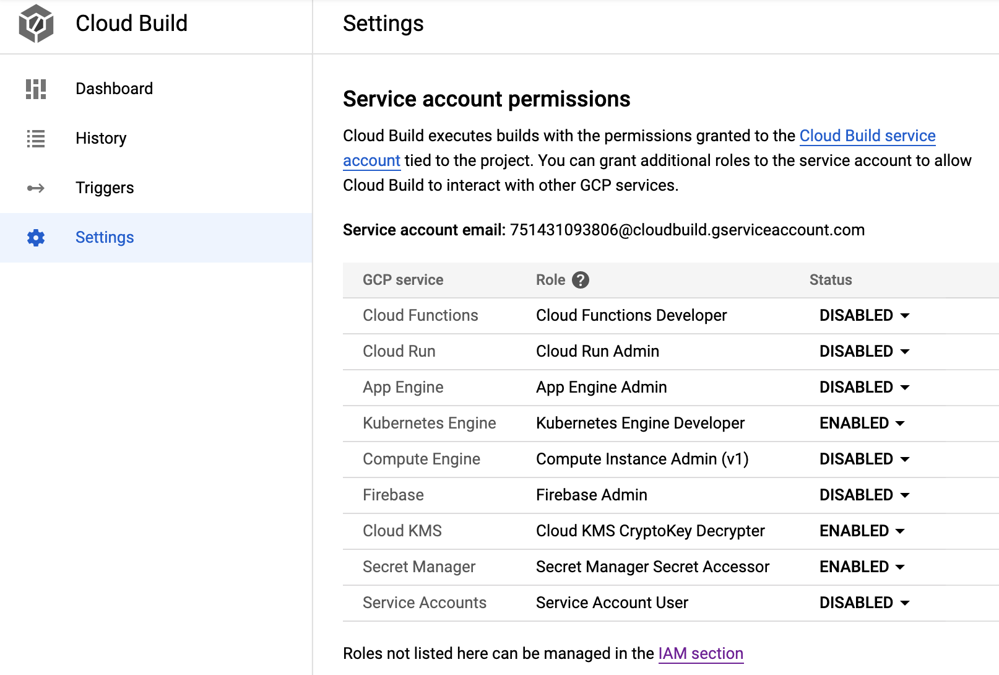
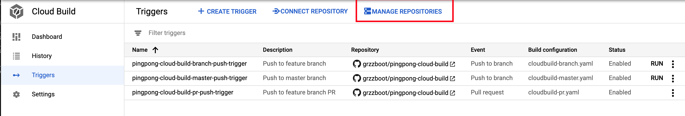
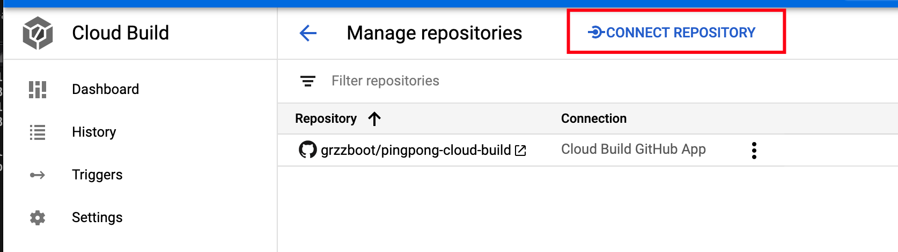

# pingpong-cloud-build

## About

A Cloud Build show case using a very simpler variant of pingpong-service and a CI/CD process for handling the same.


## Purpose

To create the struts of a CI/CD pipeline in Cloud Build for a Java project with multiple environments.

## How to try it out

### Fork the project
Since the whole thing with build triggers require a Github App setup you'll need to fork this project into your own Github org/account.

### Prepare Cloud Build

A number of steps need to be taken to get your Cloud Build ready for the job.

#### Configure Cloud Build service account
You'll be using the Google Kubernetes Engine (GKE) and Secret Manager for this show case. You'll find them under the Settings tab in the menu to the left in your GCP Web Console.



> Note! In the picture the Cloud KMS is also enabled. This is NOT needed for this show case, it's a remainder from another show case.

#### Set up secrets

##### Maven settings
First, the builds that we'll run are setup to use a custom maven `settings.xml`. It won't be needed really but it's a good practice in the scenario that you have a Maven artifact registry somewhere from which your build will need to pull dependencies, so I've prepared that for you.

You need to create a secret from such a file, and since we don't have any artifact registry it can be a very simple file:

```
<settings xmlns="http://maven.apache.org/SETTINGS/1.0.0"
  xmlns:xsi="http://www.w3.org/2001/XMLSchema-instance"
  xsi:schemaLocation="http://maven.apache.org/SETTINGS/1.0.0
                      http://maven.apache.org/xsd/settings-1.0.0.xsd">

  <activeProfiles>
    <activeProfile>maven</activeProfile>
  </activeProfiles>

  <profiles>
    <profile>
      <id>maven</id>
      <repositories>
        <repository>
          <id>central</id>
          <url>https://repo1.maven.org/maven2</url>
          <releases><enabled>true</enabled></releases>
          <snapshots><enabled>true</enabled></snapshots>
        </repository>
      </repositories>
    </profile>
  </profiles>
  
</settings>
```

In the case you'd configure for instance a Github artifact registry your file might look more like this:

```
<settings xmlns="http://maven.apache.org/SETTINGS/1.0.0"
  xmlns:xsi="http://www.w3.org/2001/XMLSchema-instance"
  xsi:schemaLocation="http://maven.apache.org/SETTINGS/1.0.0
                      http://maven.apache.org/xsd/settings-1.0.0.xsd">

  <activeProfiles>
    <activeProfile>github</activeProfile>
  </activeProfiles>

  <profiles>
    <profile>
      <id>github</id>
      <repositories>
        <repository>
          <id>central</id>
          <url>https://repo1.maven.org/maven2</url>
          <releases><enabled>true</enabled></releases>
          <snapshots><enabled>true</enabled></snapshots>
        </repository>
        <repository>
          <id>github</id>
          <name>GitHub grzzboot Apache Maven Packages</name>
          <url>https://maven.pkg.github.com/GITHUB_USER/maven-releases</url>
        </repository>
      </repositories>
    </profile>
  </profiles>

  <servers>
    <server>
      <id>github</id>
      <username>USERNAME</username>
      <password>PASSWORD</password>
    </server>
  </servers>
</settings>
```

Where `GITHUB_USER` is user or organisation in Github, `USERNAME` is the name of a user for which you've issued a personal access token and `PASSWORD` is actually the personal access token. [Read about how to create access tokens](https://docs.github.com/en/free-pro-team@latest/github/authenticating-to-github/creating-a-personal-access-token) and [how to connect to private Github artifact repositories](https://docs.github.com/en/free-pro-team@latest/packages/using-github-packages-with-your-projects-ecosystem/configuring-apache-maven-for-use-with-github-packages).


Place the file somewhere convenient, open up a console and navigate there. Create the secret in GCP by typing the following command:

```
gcloud secrets create cloudbuild-maven-settings-secret --data-file=settings.xml
```

It's important that you name the secret exactly that, otherwise the build pipelines that are predefined in this project won't work.

##### Github id RSA
The build pipelines also commit stuff (releases tags) into Github and hence you must configure SSH key-pair for Github use.

> DONT FORGET that the key must be created with a blank password, or else the handshake will fail. I forgot that and spent half a day trying to understand why it didn't work.

Read [about accessing private Github repos](https://cloud.google.com/cloud-build/docs/access-private-github-repos) to learn how to set up the key pair.

Once you have done the process then create a secret of the *private* key:

```
gcloud secrets create id-rsa-github-secret --data-file=id_github
```

Same thing here, the name is used in the pipelines so don't change it unless you're ready to adapt other stuff as well.

### Create a cluster

The show case assumes that you cluster is named `pingpong-site1-cluster` and runs in compute zone (not region) `europe-west3-a`. This is a potential improvement, I know, but right now that's the way it is.

You'll be having rolling updates of up to 3 services at the same time (3 environments) so 2-4 CPU:s should do the job.

### Connect your forked Github project

This is a manual process, thank God otherwise random people would be steeling company source code right now(!), and it is performed from the Cloud Build Triggers tab in the Web Console.






There you choose to connect to your Github repository. A process that you have to do yourself.

> NOTE! It MUST be a Github repository for this show case to work fully, because the Github App is the only type that supports PR triggers.

### Create triggers

The setup has three different Cloud Build YAML's and intended triggers to do the job.

1. `cloudbuild-master.yaml` for building master. This one will build, containerize, tag and deploy to environments
2. `cloudbuild-branch.yaml` for building branches. This one will just build
3. `cloudbuild-pr.yaml` for building PR:s. This one will build, containerize, deploy to a stage and then undeploy (after a void test)

These three gcloud commands will set the triggers up. You can also do it by hand, it's not hard. You'll probably be able to figure out what to put in the fields based on the commands below.

Master:

```
gcloud beta builds triggers create pingpong-cloud-build-master-push-trigger \
  --description=Push to master branch
  --repo-name=pingpong-cloud-build \
  --repo-owner=[REPO_OWNER] \
  --branch-pattern="^master$" \
  --build-config=cloudbuild-master.yaml
```

Branch:

```
gcloud beta builds triggers create pingpong-cloud-build-branch-push-trigger \
  --description=Push to feature branch
  --repo-name=pingpong-cloud-build \
  --repo-owner=[REPO_OWNER] \
  --branch-pattern="(?!^master$)" \
  --build-config=cloudbuild-branch.yaml
```

PR:

```
gcloud beta builds triggers create pingpong-cloud-build-pr-push-trigger \
  --description=Push to feature branch PR
  --repo-name=pingpong-cloud-build \
  --repo-owner=[REPO_OWNER] \
  --pull-request-pattern=".*" \
  --build-config=cloudbuild-pr.yaml
```

After this you can just go ahead and start making changes in the code and see the triggers trigger.

## Further improvements

- Consider persisting k8s changes to versions for test and prod (not needed for stage). This enables the setup of manual jobs for re-running just the k8s part

- Substitutions could perhaps be improved, particularly for cluster and compute zone
